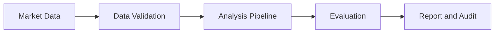
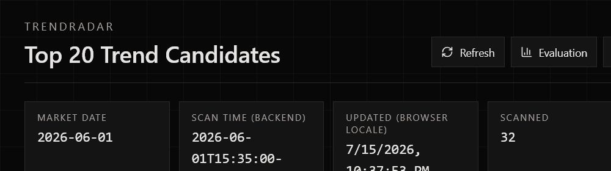
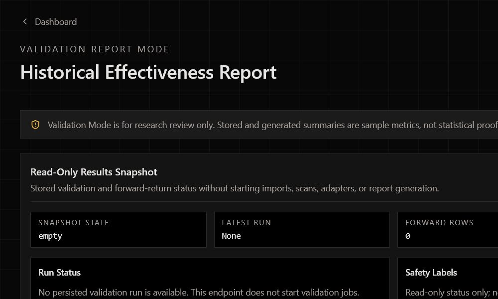
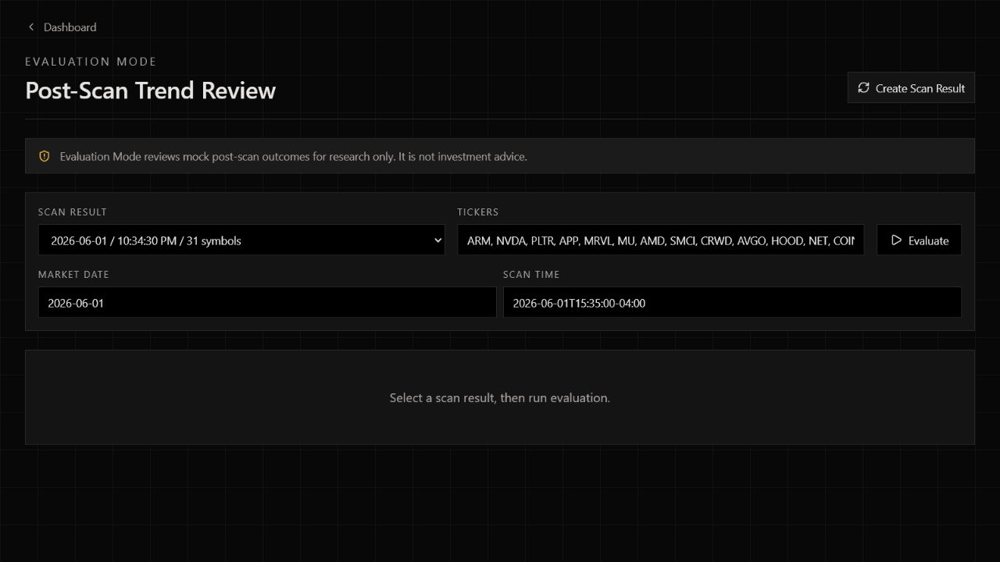
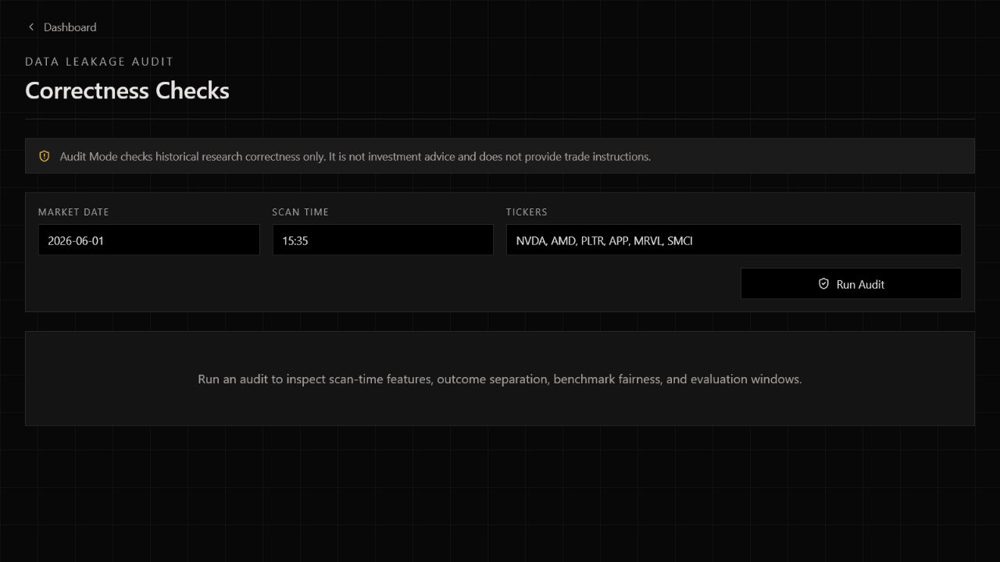
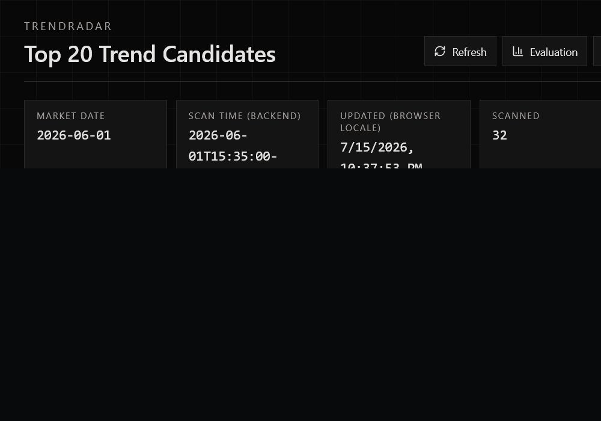

# TrendRadar Showcase

TrendRadar is a private-source research product for turning market observations into structured, reviewable trend-analysis evidence.

## The Problem

Short-term market research often becomes difficult to trust when data quality checks, analysis, evaluation, and audit evidence live in separate tools. TrendRadar explores how those activities can be organized into one reviewable product experience while keeping uncertainty and safety boundaries visible.

## Core Capabilities

- Structures market observations for consistent review.
- Applies validation before analysis is presented.
- Produces explainable analysis states rather than opaque predictions.
- Supports offline, mock-first evaluation and repeatable quality checks.
- Surfaces coverage, warning, and audit status in a usable interface.
- Preserves clear boundaries between research output and investment advice.

## High-Level Flow

## Technology

- Python and FastAPI
- TypeScript, React, and Next.js
- SQLite for local development
- Pytest and frontend static/build checks
- Git-based, agent-assisted engineering workflow

## Product Preview

All captures below use local mock data. They contain no account information, credentials, local paths, or live-provider output.

| Mock dashboard | Validation workspace |
| --- | --- |
|  |  |

| Evaluation view | Audit view |
| --- | --- |
|  |  |

## Testing and Validation

The private development repository was verified locally on 2026-07-15:

- Backend: 1,205 tests passed.
- Frontend lint: passed.
- Frontend production build: passed.
- Verification used mock-first and isolated local test boundaries.
- No live market-data provider, brokerage service, or external AI provider was called.

Only aggregate verification evidence is published here. Test source, detailed assertions, internal reports, and implementation artifacts remain private. See [Evaluation Summary](docs/evaluation-summary.md).

## My Contribution

My work focused on:

- Product requirement decomposition.
- Development-phase planning and milestone control.
- Agent/Codex work guidance and scope management.
- Acceptance-criteria and test-gate design.
- Test-result review and failure diagnosis.
- Data-safety, rollback, and recovery boundary design.
- Continuous project iteration and evidence review.

This was an agent-assisted engineering project. I directed the product and engineering process, reviewed outcomes, and defined safety and acceptance boundaries; I do not claim that every line of code was written manually or independently by me.

## Current Status and Limitations

TrendRadar is a local research MVP and engineering case study. It is not presented as deployed, production-ready, statistically predictive, or used by real customers. External-data behavior depends on separately configured providers and is intentionally excluded from this showcase.

The source code, tests, prompts, algorithms, schemas, endpoints, internal state logic, and detailed development records remain private to protect implementation details and intellectual property.

## Disclaimer

TrendRadar is for research and product-development demonstration only. It does not provide investment advice, trade instructions, performance guarantees, or automated order execution.
